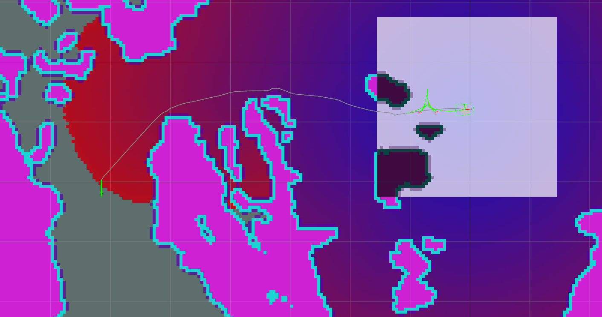

# Simple Odometry and Costmap Simulator (Nav Sim)

Simple odometry and costmap simulator for testing local and global planners



## Setup

Clone this package into your workspace  

Install dependencies:

```
rosdep install -y --from-paths . --ignore-src --rosdistro "$ROS_DISTRO"
```


## Usage

  - Publish a 2D nav goal using Rviz's "2D Nav Goal" tool and clicking somewhere on the map
  - Set the location & orientation of the robot using Rviz's "2D Nav Goal" tool. The robot will warp to wherever you click
  - Drive the robot manually using rqt's "Robot Steering" tool under `Plugins > Robot Tools`

## Defult Topics

  - By default, everything is launched under the "robot" namespace
  - **Odometry**: `/robot/odom`
  - **Map**: `/map`
  - **Steering**: `/robot/cmd_vel`
  - **Nav goal**: `/robot/move_base_simple/goal`
  - **Set pose of robot**: `/robot/set_pose`

## Dynamic reconfigure

Launch dynamic reconfigure (`rqt > Plugins > Configuration`) to view the planner's dynamic parameters

## Launching

To run the simulator with ROS's default local planner:

```
roslaunch nav_sim test.launch planner:=base
```

To run the simulator with TEB local planner:

```
roslaunch nav_sim test.launch planner:=teb
```
